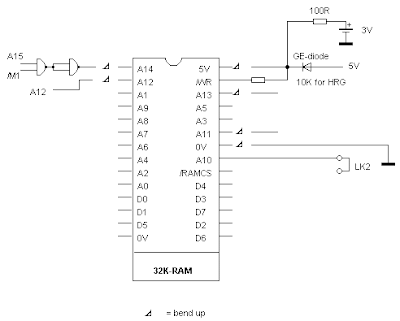
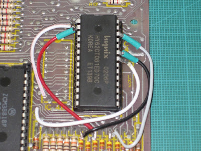
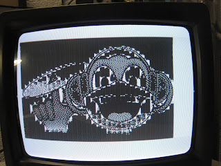
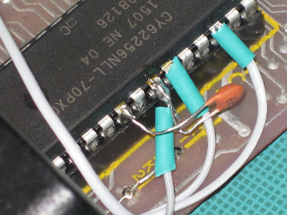
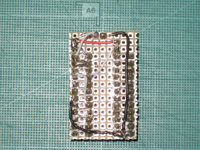
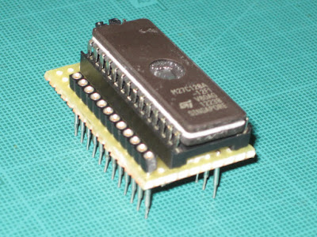

# ZX81 Mods

## Internal Memory Expansion

This expansion is based on a 62256 SRAM static memory chip (32Kb x 8 bits). Other SRAM memories such as 43256, 55257 and 62CT081 are also suitable for this modification. With this expansion you can get up to 32kB of SRAM on the ZX81 board. With a simplification to this modification, 16kB are obtained.

The diagram shown below shows the modification corresponding to 32 KB:

Below is the schematic for 16 kB:

Once this modification has been made, certain errors have been detected when executing HIRES graphics. These errors are not shown, however, with the Pseudo-HIRES, that is, in those generated entirely by software routines.

There is no clear explanation for the error obtained, but it points to a higher speed of current SRAM memories compared to older ones. The proposed solution was found at random, and consists of putting a capacitor between the /RAMCS signal (pin 20) and GND (pin 22). The suggested capacitor value ranges from 33 pF to 68 pF, passing through values of 47 pF and 56 pF.

The next photo shows the position of the capacitor.

### References:

* [ZX-Team web - Internal 32 kB for the ZX81](http://www.zx81.de/english/_frame_e.htm)

## Replacing Original ROM with EPROM

The Spectrum's original ROM is a 24-pin 2364 (8kB x 8bit) chip, and is compatible with others such as the 68764 (Motorola) and 2716 EPROMs (or the Texas 2516 equivalent). All of them are either hard to find or too expensive for the purpose. This prototype shows a common EPROM like the 27C128. This EPROM is 16kB, and knowing that the ZX81 ROM is 8kB, it would allow us to have 2 different ROMs on the chip. With a selector that bridges the signal from A13 to GND or 5V, we would be able to select one bank or the other.

The 27C128 EPROM has 28 pins, so it is necessary to make a "piggyback" circuit to be able to place it on the socket. However, the ZX81 usually mounts 28-pin sockets even though the original ROM is 24-pin. To make a correct connection of the pins of the original ROM with the EPROM it is recommended to make this additional circuit.

Many of the connections are matched, hence the importance of aligning the socket with the pin strip. Very few wiring is required.

The scheme is shown below:

### References:
[Grant Searle hardware page for ZX80/ZX81](http://searle.hostei.com/grant/zx80/zx80.html#ROM)
