# ZX81 TALK-BACK

* [Mageco Eletronic SPO256 ZX81 Vocal Synthetizer Manual in French](MANUEL-ZX81-SPO256[MAGECO].pdf)
* [Eletronics - The Maplin Magazine Mar, 05th 1983](Maplin-Electronics-1983-03-05.pdf)

# ZX81 Talk~Back by Dave Goodman (Maplin Magazine March 1983, UK)

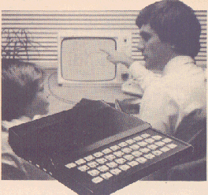

* Add speech to your programs
* Allophone set provides unlimited vocabulary
* Plugs directly into expansion socket or motherboard
* Entry from simple PEEK and POKE in BASIC
* Audio output to extemal amplifier or our 'Sound-on-TV'

For many years considerable research and development has been done in the field of human speech synthesis. All languages have their own complex speech sounds, or ALLOPHONES, which are strung together to form recognisable words. The SHAW alphabet gives an indication of speech sounds, as many schoolchildren are probably aware.
Simple words like 'cad' use the letters 'see', 'ae', and 'tee'. Stringing these allophones together will produce the sound 'seat', not at all like 'cat', so letters of the alphabet are pronounced differently according to where they are used!

General Instruments' SPO256 Orator-Speech Processor makes use of the allophone system by storing sounds, with instructions, in 16K ROM. A Microtroller control data flow from ROM to a digital filter where speech elements are linked together, along with pitch and amplitude information. The resulting information is pulse width modulated, producing a digital output which has to be low pass filtered to produce recognisable speech.
Sixty-three allophones are available for use, and by concatenating individual sounds, reproduction of entire word lengths is possible. This is very flexible, although speech quality is not as good as systems where complete words are stored.

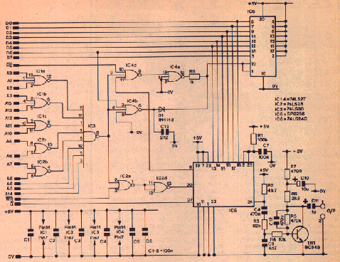


## Circuit Description

Address lines A0 to A15 are decoded by IC1, 2 and 3 to give a memory-mapped 'PORT address of 16417. This address has not been allocated to the working system of the Zx81, and as it also has a RAM location it is ideal for use in this application. Writing to this address (POKE 16417) places a negative pulse on IC5 pin 20 Address Load input. Data written into IC5, on pins 13 to 18, is then loaded onto the input port, where it is processed to give speech output on pin 24. The circuitry of TR1 forms a low pass filter, to remove any H.F. content from the speech, and the resultant signal is amplified to a usable level of 100-500mV with the output on pin 1 (pin 2 is the 0V or screen). Obviously, the computer can supply data at a far greater rate than it can be processed by IC5, so pin 8 (standby) is used to enable IC6 if the 'PORT' address is read (PEEKed).

With suitable programming IC6 will place D0 to D8 to binary 0 and a software loop will prevent further data being entered to IC5 until the standby output resets. One problem, however, becomes apparent when the system is first switched on; R1 and C7 reset the SPO256 and pin 8 goes low. While the ZX81 CPU is resetting RAM locations, IC6 is enabled and data is prematurely entered, causing the computer to crash. lC4b, C13, and D1 hold IC6 pins 1 and 19 high to prevent this happening. Entering the command NEW can also cause this problem, but not if you are using 1 to 16K RAM. C13 may need to increase in value if larger RAM is used, and this is a subject for experimentation.


## Construction

Insert all 48 track pins through the holes marked with a circle, and solder them on both sides of the PCB. Fit resistors R1 to R7; if using the new 1% resistors with 5 band colour codes make sure that the values are correct. Finally, fit all capacitors, noting the polarity marking on C10. Do not insert the ICs yet. Solder all components to the PCB, clean, and inspect your work. Many faults can be cleared by using thinners and a stiff brush to remove all flux and solder splashes from the PCB.

If you do not possess a mother-board, fit a 2 x 23 socket (RK35Q) to the edge connector and solder all pins. Otherwise plug the module into your ZX81.

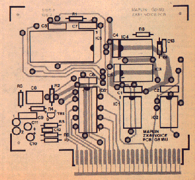


## Testing

Apply power. If all is well the cursor will appear as normal. Use a voltmeter to check that the 0V and +5V rails are correct on the PCB. Switch off and insert the six ICs into their sockets. Re-apply power. The cursor should appear again. You will need either an external amplifier or our sound/video project with connections to pins 1 and 2 on the module. Turn the amplifier or TV volume control to an acceptable level and type in POKE 16417, 197 followed by NEWLINE. You should hear the allophone 'oy' and a continuous 'e' sound. Type POKE 16417,0 NEWLINE and the sound will cease. Thus far, all should be well. Now enter program 1 and run it. Various prompts and directions appear during the program run and allophone sounds, not words, will be heard. Run the program several times to familiarise yourself with each sound and code number.


## Using the Talkback

If you refer to the Sinclair Manual page 178, you will see that address 16417 is not used by the working system. Fortunately this address, being part of the memory map, has a location in RAM which makes it ideal for use a a 'PORT'. Data POKEd to this address is read by the SPO256 chip, so the numbers entered must range from 192 to 255 to suit.
Table 1 gives a list of numbers and their equivalent allophone sound. Also shown is a list of ZX81 characters corresponding to each number and allophone. If a word, like COMPUTER, is phonetically split into a series of vowels and consonants the allophone equivalent will be something like this:

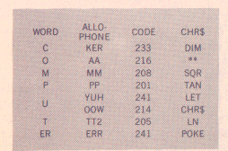


## Allophones

The 5P0256 has 63 allophones, five of which are pauses of different duration, which leaves 58 to span the range of the English language. Because of this limitation compromises have to be made with pronunciation, but, in practise it is not a real problem as long as you do not mind your computer speaking with an American accent!

The letter c in computer does not sound like 'see', but 'k' as in kite. A short pause, e.g. code 194 (50ms) inserted between C and computer enhances the C, as can be heard in program 2. If you ran the test program, you will have heard each allophone spoken, and be already familiar with the sounds available, so now enter program 2.
The technique used in this program relies on placing allophone code numbers as CHR$ in line 1 after the REM statement. Altogether there are 18 CHRS in this line, including pauses. The first address after REM is 16514, so each character has its own address to 16532. The value of each address is POKEd into variable A, this being the PORT address of the speech processor, and line 1 is scanned, a character at a time, by line 10.

A software loop is set up by line 25 to allow time for each allophone to be spoken before continuing with the next instruction. Try removing line 25 from the program and listening to the difference.

Maybe you have your own routines for POKEIng numbers into port locations, so I won't go into programming techniques on the ZX81. Needless to say, if using this method the address must be found for the first character to be read after REM, otherwise your program may crash. Some of the allophone CHR$ must be entered in command word mode. One way of doing this is to first enter THEN (shift CHRS) to change the cursor from L to K, and then enter the command word. Step the cursor back to THEN and RUBOUT.

Step the cursor forward past the command word, and continue with the next CHR$. Always add a space (192 or "") at the end of the character string or insert POKE 16417,0 at the end of your program, otherwise speech will continue.
FOR-NEXT or PAUSE delays can be entered after the POKE 16417 command to slow down speech if you find that it talks too fast. Use codes 192 to 196 to add pauses between allophones where required. Previous sounds spoken can then be emphasised to suit the word formation, and speech made more intelligible.

Program 1.
```
1 REM TEST PROGRAM
2 LET A = 197
3 LET PORT = 16417
4 PRINT "PRESS NEWLINE"
5 IF INKEY$ = " " THEN GOTO 5
6 PRINT "ALLOPHONE ""OY"" WILL BE SPOKEN"
7 PAUSE 250
6 POKE PORT,A
9 POKE PORT,0
10 CLS
11 PRINT "NUMBER 197 TO 255 WILL BE DISPLAYED AND THE ALLOPHONE SPOKEN."
12 PAUSE 500
13 FOR A = 197 TO 255
14 PRINT AT 10,14;A
15 POKE PORT,A
16 FOR B = 0 TO 10
17 NEXT B
18 POKE PORT,192
19 NEXT A
20 POKE PORT,192
21 PRINT AT 15,0:"PRESS NEWLINE TO REPEAT TESTS"
22 INPUT A$
23 CLS
24 GOTO 11
```

Program 2.
```
1 LEN "" AT AND SQR "" TAB USR DIM AT ** SQR TAN LET CHR$ LN NEXT""
3 LET A = 16417
5 LET B = 16514
7 REM NUMBER OF CHR$
10 FOR C = B TO (B+17)
15 POKE A,PEEK C
20 REM WORD LENGTH
25 PEEK A=0 THEN GO TO 25
30 NEXT C
35 CLS
40 PRINT " ""I AM A COMPUTER"" "
45 PRINT AT 18.0;"PRESS NEWLINE"
50 INPUT A$
60 GOTO 1
```

Table 1
| chr$ | code | allophone | chr$ | code | allophone | chr$ | code | allophone |
|------|------|-----------|------|------|-----------|------|------|-----------|
| "" | 192 | pause 10ms | chr$ | 214 | oow | for | 235 | zer |
| at | 193 | pause 30ms | not | 215 | ao | goto | 236 | na |
| tab | 194 | pause 50ms | ** | 216 | aa | gosub | 237 | ll |
| code | 196 | pause 200ms | or | 217 | ye | input | 238 | ww |
| val | 197 | oy | and | 218 | ae | load | 239 | re |
| len | 198 | ay | <= | 219 | hh1 | list | 240 | wh |
| sin | 199 | eh | >= | 220 | bu | let | 241 | yuh |
| cos | 200 | kk3 | <> | 221 | th | pause | 242 | ch |
| tan | 201 | pp | then | 222 | uo | next | 243 | ere |
| asn | 202 | jh | to | 223 | uoo | poke | 244 | err |
| acs | 203 | nn | step | 224 | ou | print | 245 | uo |
| atn | 204 | 1h | lprint | 225 | dd2 | plot | 246 | dh2 |
| ln | 205 | tt2 | llist | 226 | gg | run | 247 | ss |
| exp | 206 | rr1 | stop | 227 | ve | save | 248 | nnn |
| int | 207 | ax | slow | 228 | gu | rand | 249 | her |
| sqr | 208 | mm | fast | 229 | ssh | if | 250 | or |
| sgn | 209 | tt1 | new | 230 | sz | cls | 251 | ar |
| abs | 210 | dh1 | scroll | 231 | r | unplot | 252 | yr |
| peek | 211 | iy | cont | 232 | ff | clear | 253 | ggg |
| usr | 212 | ey | dim | 233 | ker | return | 254 | el |
| str$ | 213 | dd1 | rem | 234 | ku | copy | 255 | bb | 


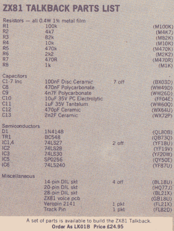


---

## ZX81 Talk-Again

* [Talk-Again Repos by MCarlson](https://github.com/mcarlson-sb/talk-again)

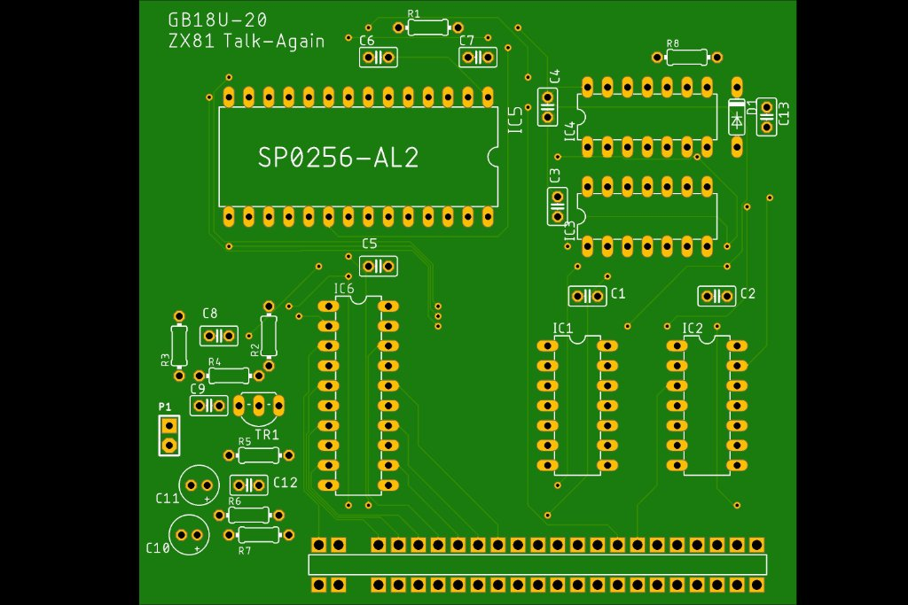

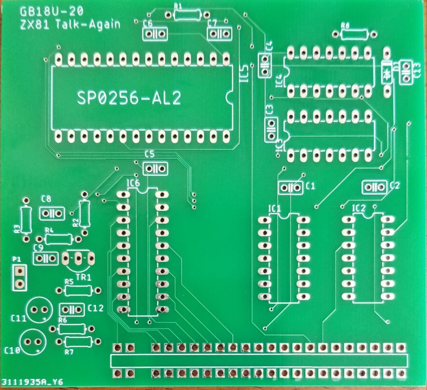


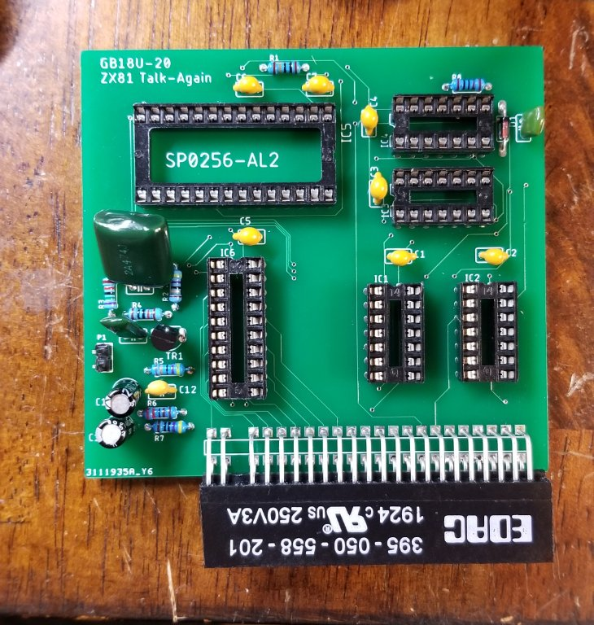

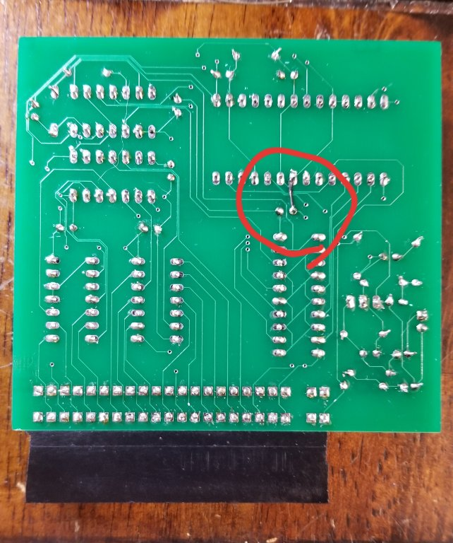

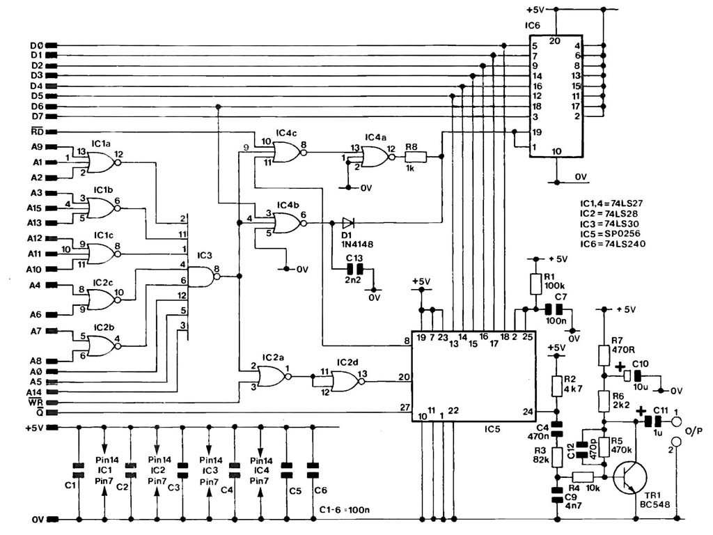

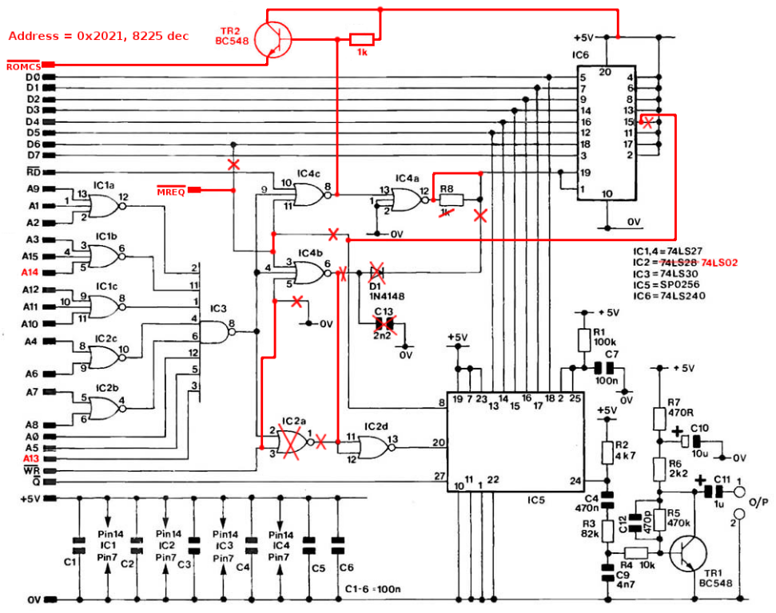